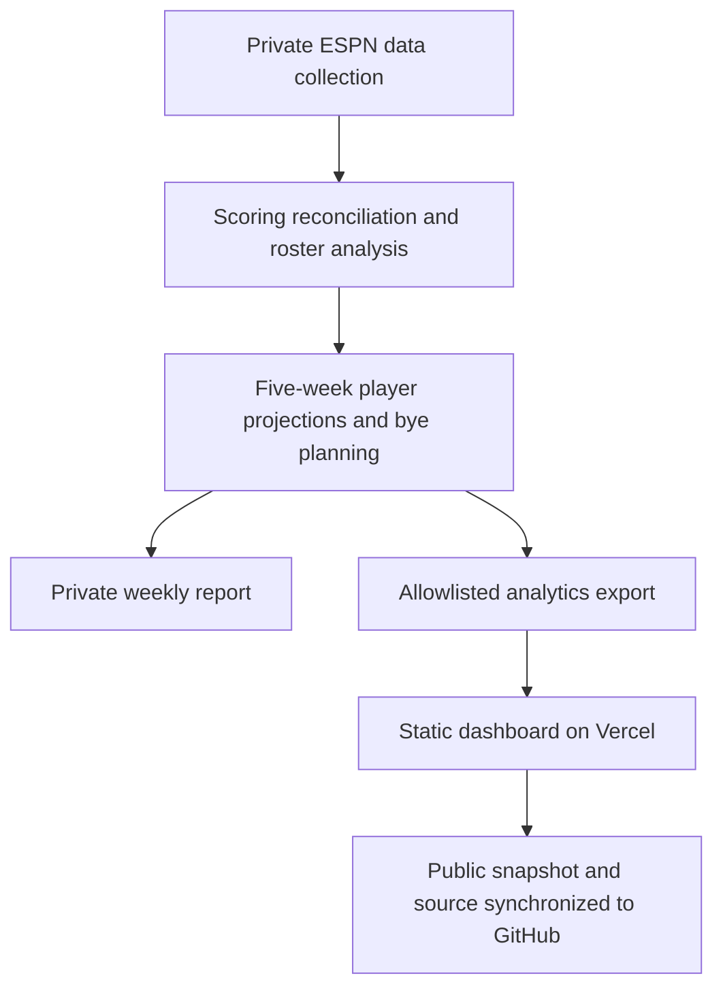

# ESPN Fantasy Football GM

A portfolio dashboard that turns fantasy football data into specific roster decisions: who to start, who to add and drop, which trade packages merit discussion, and how to cover upcoming byes.

**[Open the live dashboard](https://espn-fantasy-football-gm.vercel.app)**

Independent portfolio project; not affiliated with or endorsed by ESPN. ESPN branding belongs to its respective owner.

## The problem

League scores alone do not tell a manager what to do next. This project compares roster strength with the league, evaluates legal lineups with FLEX counted separately, and presents recommendations with named players and projected point effects. A justified hold is a valid recommendation.

## Features

- **Weekly overview:** team and league scoring, average weekly points, and hindsight lineup efficiency.
- **Player decisions:** start/sit recommendations focus on the coming scoring week; add/drop and hold decisions include named players and numerical evidence.
- **Bye planning:** five weeks of ESPN projections and named replacements for upcoming absences.
- **Position Analysis:** one range bar per position with league low/high, 25th and 74th percentiles, median, mean, and the managed team's value.
- **Trade analysis:** one- and two-player packages, both teams' lineup effects, and explicit rejection of marginal deals.
- **Weekly history:** selectable dated snapshots, including clearly labeled historical live samples.

## Architecture



This repository contains the public presentation layer and exported analytics. The private collector, email integration, roster execution tools, credentials, approval records, and database are excluded. Public visitors cannot change a roster or submit a transaction.

## Stack and design choices

Vanilla JavaScript, HTML, CSS, SVG charts, and JSON snapshots. No frontend framework, paid database, tracking service, or runtime backend is required. The static frontend is separate from authenticated data collection. Each recommendation includes its report week and projection basis.

## Run locally

With Python installed:

```sh
python -m http.server 8080 --directory public
```

Open http://localhost:8080. The included snapshots work without ESPN credentials. `vercel.json` configures `public` as the deployment output directory and supplies security headers.

## Weekly updates

The owner's existing local job runs Tuesdays at 8 a.m. America/Los_Angeles. It generates the private report, exports anonymized analytics, publishes Vercel, then commits and pushes changed public files here. The computer must be awake and authentication must remain valid. This is not a GitHub Actions or Vercel cron job. Failed runs leave the previous snapshot visible; the dashboard shows data timestamps and stale-data warnings. Copying this repository does not grant access to the private collector or schedule.

## Data and recommendation limits

- Current decisions compare ESPN projections, not guaranteed results.
- Pickup analysis models this week and the next four, including byes; it identifies the outgoing player and preserves skill-position depth when streaming kicker or defense.
- Current position distributions and trade values sum optimized weekly starting lineups from the upcoming week through the league final, including byes and required drops. Completed weeks are excluded; forecasts are estimates and playoff participation is uncertain. Older snapshots retain their original season-total proxy basis.
- Hindsight efficiency uses completed results and is separate from forward-looking start/sit advice.
- Available-player search uses a sampled ESPN pool; future availability and waiver costs can change.
- Historical snapshots may lack fields added later.

## Privacy

Only allowlisted public analytics are synchronized. The managed team is named by permission. Other league identities use two leading letters plus a stable salted hash; NFL player names remain readable. This is pseudonymization: knowledgeable league members may still infer identities from rosters. Personal stories, email addresses, private messages, credentials, salt keys, and transaction approval records are excluded.

## Repository layout

```text
public/
  index.html          Dashboard shell
  app.js              Views, recommendation headlines, and charts
  styles.css          Responsive visual design
  data/reports.json   Anonymized dated snapshots
vercel.json           Static hosting configuration
```
